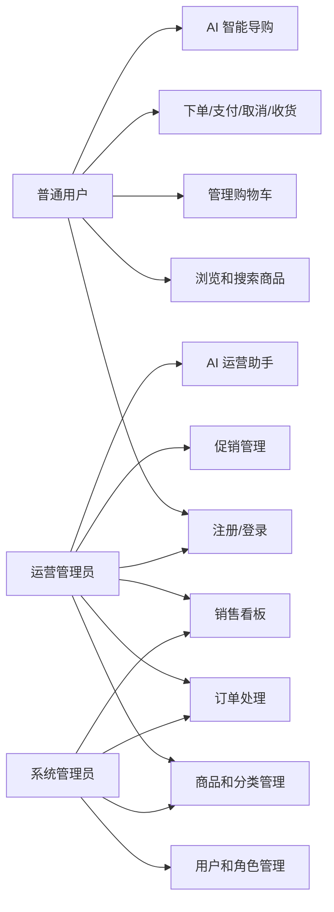
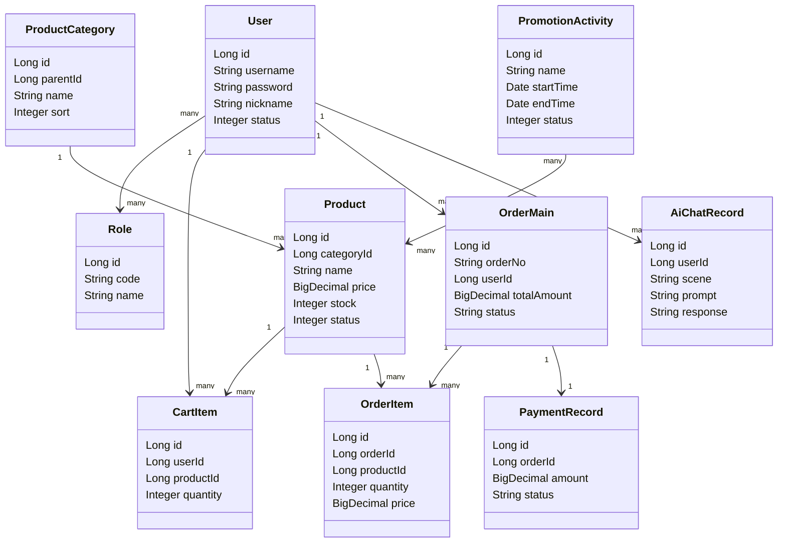
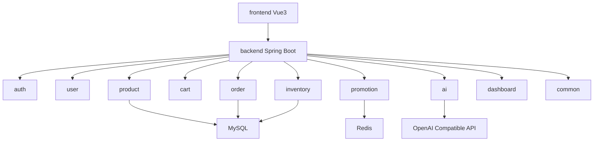
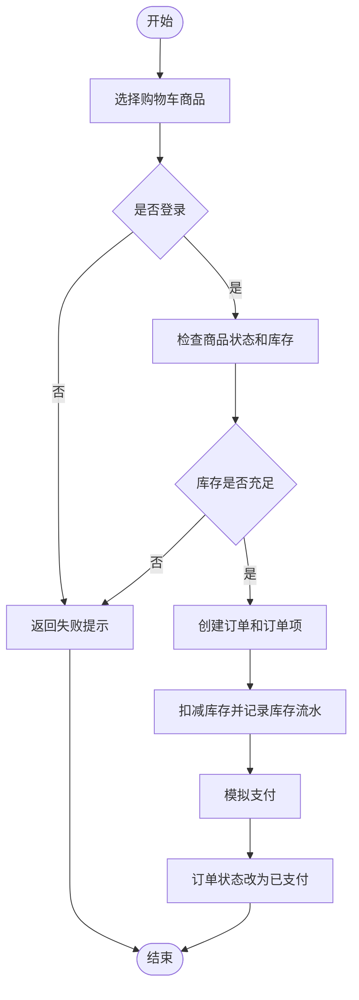
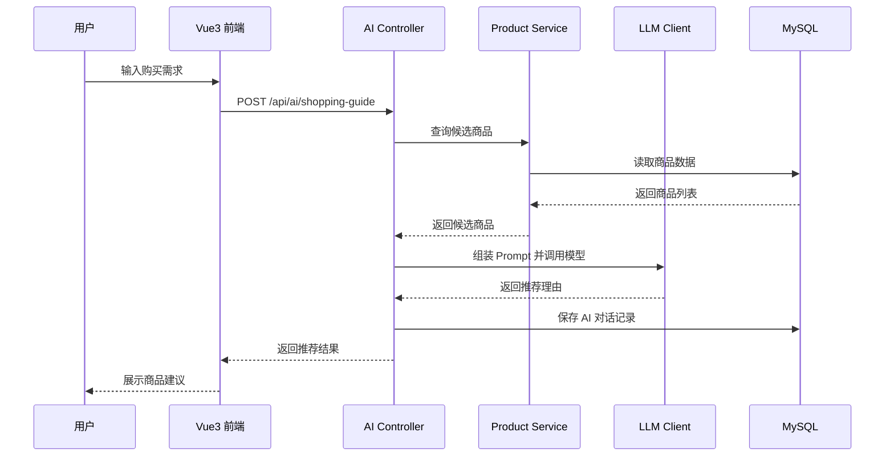
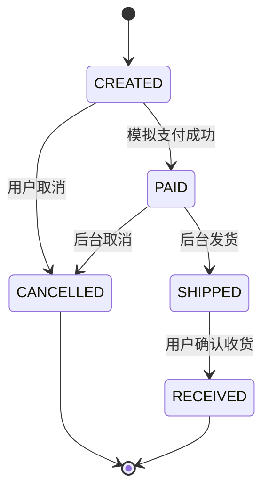

# UML 草稿

以下 UML 使用 Mermaid 语法表达，后续可根据课程文档要求转换为图片。

## 1. 用例图草稿

```mermaid
flowchart LR
    User["普通用户"]
    Operator["运营管理员"]
    Admin["系统管理员"]

    Login["注册/登录"]
    Browse["浏览和搜索商品"]
    Cart["管理购物车"]
    Order["下单/支付/取消/收货"]
    AiGuide["AI 智能导购"]

    ProductAdmin["商品和分类管理"]
    OrderAdmin["订单处理"]
    PromotionAdmin["促销管理"]
    Dashboard["销售看板"]
    AiOperation["AI 运营助手"]
    UserAdmin["用户和角色管理"]

    User --> Login
    User --> Browse
    User --> Cart
    User --> Order
    User --> AiGuide

    Operator --> Login
    Operator --> ProductAdmin
    Operator --> OrderAdmin
    Operator --> PromotionAdmin
    Operator --> Dashboard
    Operator --> AiOperation

    Admin --> UserAdmin
    Admin --> ProductAdmin
    Admin --> OrderAdmin
    Admin --> Dashboard
```

## 2. 领域类图草稿

```mermaid
classDiagram
    class User {
        Long id
        String username
        String password
        String nickname
        Integer status
    }

    class Role {
        Long id
        String code
        String name
    }

    class ProductCategory {
        Long id
        Long parentId
        String name
        Integer sort
    }

    class Product {
        Long id
        Long categoryId
        String name
        BigDecimal price
        Integer stock
        Integer status
    }

    class CartItem {
        Long id
        Long userId
        Long productId
        Integer quantity
    }

    class OrderMain {
        Long id
        String orderNo
        Long userId
        BigDecimal totalAmount
        String status
    }

    class OrderItem {
        Long id
        Long orderId
        Long productId
        Integer quantity
        BigDecimal price
    }

    class PaymentRecord {
        Long id
        Long orderId
        BigDecimal amount
        String status
    }

    class PromotionActivity {
        Long id
        String name
        Date startTime
        Date endTime
        Integer status
    }

    class AiChatRecord {
        Long id
        Long userId
        String scene
        String prompt
        String response
    }

    User "many" --> "many" Role
    ProductCategory "1" --> "many" Product
    User "1" --> "many" CartItem
    Product "1" --> "many" CartItem
    User "1" --> "many" OrderMain
    OrderMain "1" --> "many" OrderItem
    Product "1" --> "many" OrderItem
    OrderMain "1" --> "1" PaymentRecord
    PromotionActivity "many" --> "many" Product
    User "1" --> "many" AiChatRecord
```

## 3. 包图草稿

```mermaid
flowchart TB
    Frontend["frontend Vue3"]
    Backend["backend Spring Boot"]
    Auth["auth"]
    UserPkg["user"]
    ProductPkg["product"]
    CartPkg["cart"]
    OrderPkg["order"]
    InventoryPkg["inventory"]
    PromotionPkg["promotion"]
    AiPkg["ai"]
    DashboardPkg["dashboard"]
    CommonPkg["common"]
    MySQL["MySQL"]
    Redis["Redis"]
    LLM["OpenAI Compatible API"]

    Frontend --> Backend
    Backend --> Auth
    Backend --> UserPkg
    Backend --> ProductPkg
    Backend --> CartPkg
    Backend --> OrderPkg
    Backend --> InventoryPkg
    Backend --> PromotionPkg
    Backend --> AiPkg
    Backend --> DashboardPkg
    Backend --> CommonPkg

    ProductPkg --> MySQL
    OrderPkg --> MySQL
    InventoryPkg --> MySQL
    PromotionPkg --> Redis
    AiPkg --> LLM
```

## 4. 下单活动图草稿

```mermaid
flowchart TD
    Start([开始])
    SelectCart["选择购物车商品"]
    CheckLogin{"是否登录"}
    CheckStock["检查商品状态和库存"]
    Enough{"库存是否充足"}
    CreateOrder["创建订单和订单项"]
    DeductStock["扣减库存并记录库存流水"]
    Pay["模拟支付"]
    Paid["订单状态改为已支付"]
    Fail["返回失败提示"]
    End([结束])

    Start --> SelectCart --> CheckLogin
    CheckLogin -- 否 --> Fail --> End
    CheckLogin -- 是 --> CheckStock --> Enough
    Enough -- 否 --> Fail
    Enough -- 是 --> CreateOrder --> DeductStock --> Pay --> Paid --> End
```

## 5. AI 导购顺序图草稿

```mermaid
sequenceDiagram
    participant U as 用户
    participant V as Vue3 前端
    participant A as AI Controller
    participant P as Product Service
    participant L as LLM Client
    participant D as MySQL

    U->>V: 输入购买需求
    V->>A: POST /api/ai/shopping-guide
    A->>P: 查询候选商品
    P->>D: 读取商品数据
    D-->>P: 返回商品列表
    P-->>A: 返回候选商品
    A->>L: 组装 Prompt 并调用模型
    L-->>A: 返回推荐理由
    A->>D: 保存 AI 对话记录
    A-->>V: 返回推荐结果
    V-->>U: 展示商品建议
```

## 6. 订单状态机草稿

```mermaid
stateDiagram-v2
    [*] --> CREATED
    CREATED --> PAID: 模拟支付成功
    CREATED --> CANCELLED: 用户取消
    PAID --> SHIPPED: 后台发货
    SHIPPED --> RECEIVED: 用户确认收货
    PAID --> CANCELLED: 后台取消
    CANCELLED --> [*]
    RECEIVED --> [*]
```

